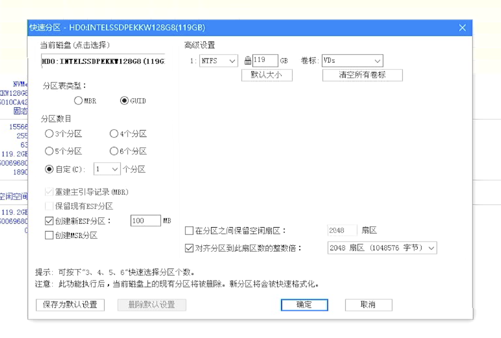

# 三分钟装好Windows 11专业版

三分钟装好Windows 11专业版，不可能有那么快的速度吧，再快的PC，安装过程都要做选择和设定，三分钟显然是不够用的。
有同学比较专业，说用Windows自动应答文件来设置，就不需要手动选择和设定了。确实，这也是一种不错的方法。
咱们这里不使用这个方法，用一种全新的方式来部署，不仅可以部署windows11，也可以部署Windows10，甚至Ubuntu、国产深度操作系统也可以。

## 新方法：云固件

这里我们要用“云固件”的方式来部署。
要在三分钟内部署完成，传统的安装方式是行不通的。云固件选择的方式是将系统部署在虚拟机的镜像文件中，比如Hyper-V使用的VHDx格式镜像文件。用过虚拟机的同学很容易理解这种格式的文件，相当于虚拟机内的硬盘，操作系统、驱动程序、应用软件、配置信息、数据都可以保存在镜像文件中。
有了镜像文件，相当于有了硬盘，剩下的就是怎么让这块虚拟硬盘中间的操作系统正常启动起来。云固件就是镜像文件的启动管理器。通过简单的配置，云固件可以读取到镜像文件信息，然后生成图形界面，让用户选择需要启动的镜像，最终引导镜像文件内的操作系统。


云固件支持“独占安装模式”、“移动模式”、“外置模式”、“混合模式”等四种安装方式，其中“外置模式”最简单。
外置模式，其实就是把云固件作为操作系统引导管理器安装到U盘或者移动硬盘里面，用U盘或者移动硬盘来启动。安装过程可百度知乎上的“云固件”专栏，或者等待后面的公众号文章。着急的朋友也可以搜索“AINUC99”添加“云固件小助手”，购买包含云固件和常用云固件镜像的“云固件快装U盘”。近期，云固件快装U盘也会上线云固件视频号小店进行销售。


## 安装准备

首先，准备一个已经安装好云固件的U盘或者移动硬盘；
其次，一台2010年以后生产的计算机，要求是UEFI的BIOS；
第三，下载Windows 11 Pro的镜像文件。
下载地址：[Windows 11 22H2 Professional Level 1](https://pan.baidu.com/s/1qpRqRhTlG5PTk0EfspJomw)

安装的计算机可以是新计算机，也可以已经安装好系统的计算机，云固件的安装过程是无损的，不会破坏已经存在的系统。

## 安装步骤

1.启动计算机
使用自制云固件U盘或者云固件快装U盘启动计算机，制作教程里面都会提供一个PE的启动镜像，选择PE启动，进入桌面；
有Windows系统的计算机可直接进入桌面。

2.复制镜像文件
空白硬盘的话，先对硬盘进行GPT模式分区，创建ESP分区和VDs镜像存储分区。

VDs分区使用NTFS格式进行格式化。
已经安装有系统的硬盘，选择一个空余空间比较大的NTFS格式分区，我们在此也称呼这个分区为VDs分区。

将下载的镜像文件夹直接复制到VDs分区。复制完成后，进入文件夹，找到内部的7z文件，进行解压缩，解压缩文件保存在当前文件夹。


3.添加或更新vd.config
云固件的镜像复制到VDs分区后，云固件是无法了解到镜像文件所在位置的，所以需要设置一个配置文件，这个配置文件就是vd.config。vd.config必须位于VDs分区的根目录下。

如果已经存在vd.config，那么用记事本或其他文本编辑器打开文件，添加下面内容到文件中。如果已经存在，那么就不用添加。

``` shell
include \b1882792\menu.config
```

如果没有vd.config，那么直接创建一个文本文件，命名为vd.config，添加以上内容即可。


如果您使用的是云固件快装U盘，那么您直接复制快装U盘上MW分区下的vd.config到VDs分区即可，不用做任何修改。

4.重新启动计算机
镜像文件安装完成后，即可选择重新启动计算机。启动时，需要选择从云固件U盘启动。配置文件没有错误的话，系统将进入云固件主界面，使用上下左右方向键选择刚才添加的Windows 11 Pro镜像图标，然后回车，Windows启动徽标就会显示出来，桌面马上就会呈现出来。

## 注意事项

云固件U盘和云固件快装U盘目前都是使用了临时的安全启动模式，首次启动需要导入一下安全证书，按照下图操作即可：


## 总结

本例中安装的Windows11专业版镜像只包含了Windows默认自带的驱动，通常都会缺少部分驱动，需要用户进一步补充完整。用户可以安装完善Windows11专业版镜像后，将这个镜像文件保存为自用的镜像，后续再安装时就可以选用自用镜像，即可一步到位完成全部安装。当然，也可以把常用的软件、配置、数据到保存到镜像里面留存为后续部署镜像。

云固件镜像部署模式将系统安装转换为镜像文件的拷贝操作，在SSD的超高速下，真的可以实现3分钟部署完系统，甚至直接部署为完善的应用环境，是不是非常简单和有意思？

欢迎大家关注“云固件”公众号；
更多说明可参考知乎上“云固件”专栏文章和视频，后续内容更新将在“云固件”公众号首发；
云固件相关文章和视频可在搜索引擎上搜索“云固件”或者“AINUC云固件”；
欲了解更多信息可微信搜索“AINUC99”添加云固件小助手咨询，也可以直接扫描主界面内二维码添加。

云固件及云固件镜像提及的品牌、商标均为各自的所有者所拥有。
