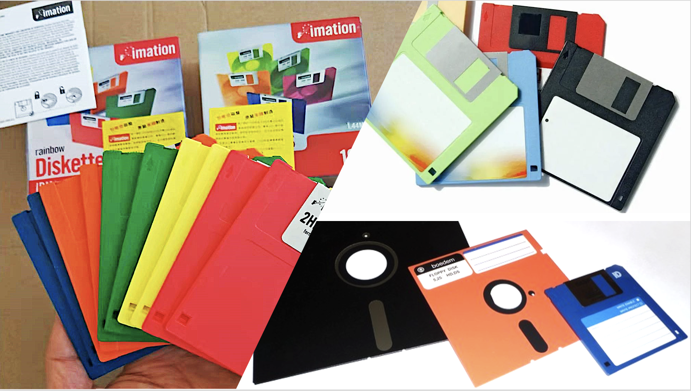
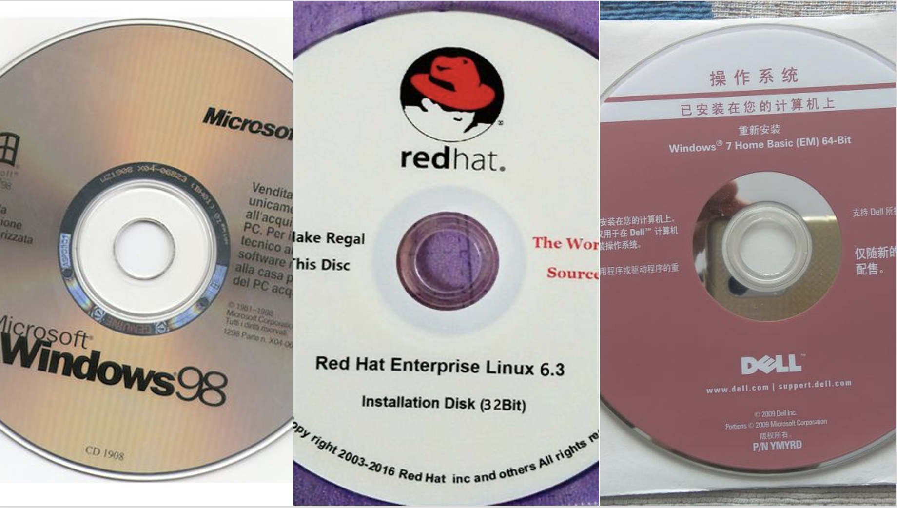
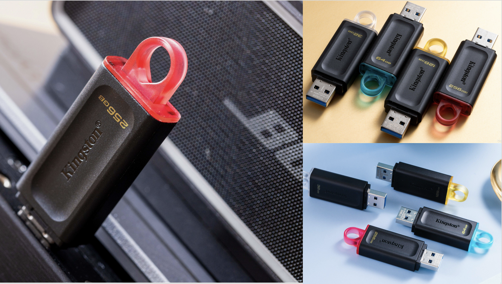
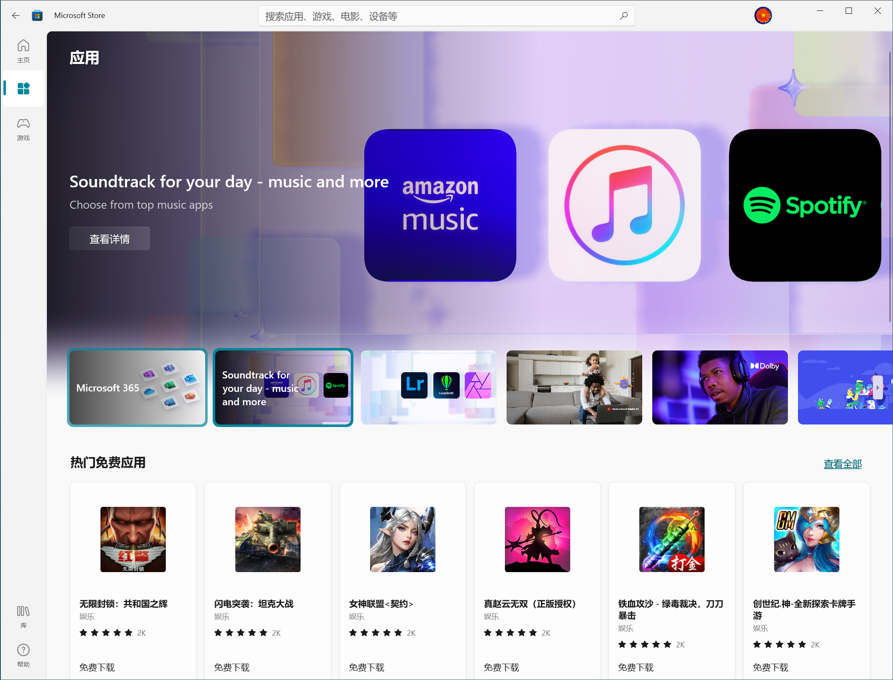
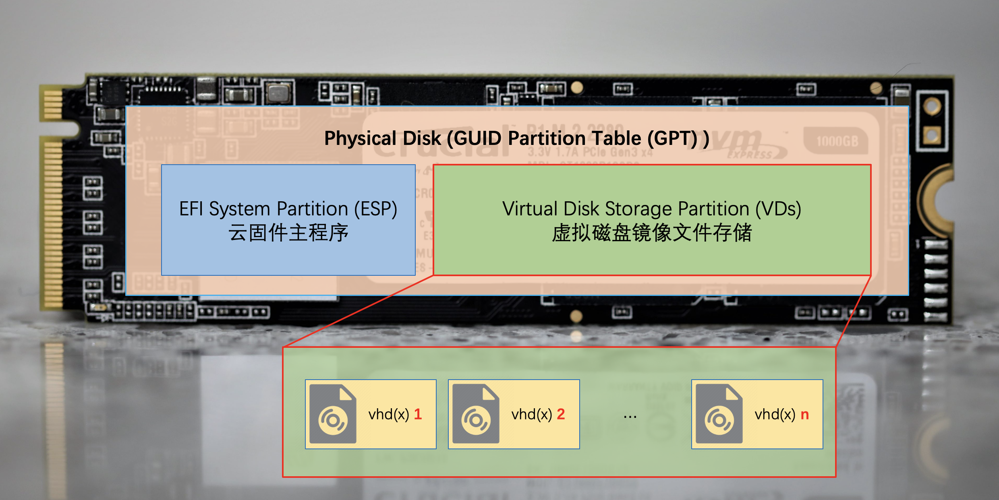

# 云固件是什么？

AINUC®️云固件（Multiware）是基于UEFI标准的固件扩展应用程序，通过将包含虚拟磁盘的镜像文件模拟为标准磁盘，实现了镜像文件内操作系统启动、多镜像文件切换以及复杂应用系统（包含操作系统、驱动程序、应用软件、配置信息、用户数据）快速部署，亦可支持虚拟磁盘镜像文件部署在移动存储设备。

## 1.传统个人计算机部署的不足

个人计算机从二十世纪70年代末发明至今已经过去了超过40年，在这期间硬件的革新是显而易见的，计算速度取得了突飞猛进的提升，集成度得到了肉眼可见的变化，软件的稳定性和易用性也得到了巨大的进步。在Intel x86的架构下，芯片、板卡、主机、操作系统、应用软件构成的生态空前的繁荣。随着互联网带来的全球在线，个人计算机也成为人类全球链接的必备神器。

个人计算机作为一个生产力、创造力、家庭娱乐、游戏工具，本质上是硬件与各种软件的组合体。软件包括操作系统、应用软件、配置信息、业务数据等等，这些内容都是保存在计算机的存储设备上。当计算机没有软件时，实质上只能是一个空机器。因此，一台崭新的计算机变成可用时，需要花费较多时间和精力去部署各种软件，最基本的就是操作系统，其次是利用各种应用软件来搭建一个用户工作、生活、游戏或者娱乐的系统环境。

操作系统的部署是第一步，从最早的软盘，到后来的光盘，到最近的U盘，以及通过网络的方式，实质上都是一种传输介质的提供方式。对于专业的用户和有IT人员的组织来说，部署的操作过程困难可以解决；对于非专业的普通用户来说，部署的操作过程困难需要转移给其他专业用户或者组织才能解决。进一步来讲，常规部署需要耗费较长时间，使用专业工具可以缩短时间并提高效率，但便捷性和效率还是需要进一步提升。

软盘

光盘

U盘

从本世纪初互联网泡沫破灭开始算起，人类进入互联网时代已经超过了20年，接入互联网的设备从专业计算机拓展到了移动端的手机、平板，便利性无处不在。软件应用商店的模式也被大家广为认可和接受，传统的软件安装方法在手机、平板上反倒成了小众方式。

那么，在计算机上能不能实现借助互联网的方式实现个人计算机的系统环境部署呢？

有人就会说现在Windows上Microsoft Store算不算？我想说，微软应用商店本质上只是一个软件分发方式，在Windows系统上解决了软件查找、下载和安装问题。同样的工具在Ubuntu等Linux发行版下也都能找到对应的软件。这类工具只是在操作系统上实现的应用级别的商店。

微软应用商店

从裸机直接部署应用系统环境是一个有技术难度和运营难度的挑战。AINUC®️云固件就是在这种挑战下应运而生了。

## 2.云固件的基本原理

应用软件运行在操作系统环境上，在操作系统上实现应用的查找、下载和安装是相对容易，本质上也是一直都存在的方式，应用商店只是对过程的重新组合。当苹果手机上的App Store首次提出应用商店概念后，Windows、Android、Ubuntu等迅速实现了类似功能。

为了让操作系统也能被部署，裸机部署必须借助第二操作系统系统或者其他方法。什么是第二操作系统，比如Windows安装时启动的Windows PE环境就是第二操作系统。这个系统只是在安装部署Windows时需要。Ubuntu的LiveCD等也是类似的情况。这类系统是配合介质一起使用的，本质上还需要介质本身以及找寻合适的资源。

云固件选择了其他的方法，从命名中也可以看出方法所在，就是固件。

固件的标准定义是指硬件加电自举启动之后到操作系统启动之前，实现管理电源、配置硬件、引导操作系统这部分的软件，在PC上通常就是指BIOS，现在新一代的PC都是用UEFI作为现代的BIOS，以前的BIOS都被改称为Legacy BIOS。这部分软件通常都是刷入芯片进行固化存储的，所以被称为固件。云固件这个项目就是UEFI上的软件开发。

正常部署的个人计算机启动后，固件会检测硬盘，找到硬盘上的ESP启动分区，执行操作系统提供的UEFI引导程序，进而启动操作系统内核。

安装云固件的计算机加电启动后，正常完成自检，然后查找到模拟成操作系统的云固件程序，云固件此时就接管了计算机控制权。之后，云固件可以执行启动网络、查询可用虚拟磁盘镜像文件、下载虚拟磁盘镜像文件、配置虚拟磁盘等动作，并在友好的图形界面内提供选择菜单供用户做选择，用户选择后，找到对应虚拟磁盘镜像文件并模拟为标准磁盘，引导镜像文件内的UEFI引导程序，引导程序再启动对应虚拟磁盘镜像文件内的操作系统，完成启动过程。并且，操作系统内核启动后，云固件随UEFI的退出就释放计算机的控制权。

## 3.云固件的优势

通过对云固件的原理讲解，大家可以看到云固件可以支持网络访问互联网资源，并且使用虚拟磁盘镜像文件作为存储容器。

在这两项核心功能的加持下，首先，云固件可以直接通过网络获取数据，而服务端可以识别请求来源和特征信息，因此可以确定需要推送的资源类型，这些资源一定是和请求方的硬件特性相匹配的；
其次，下载的资源不同于传统的系统部署写入磁盘的扇区，而是使用虚拟磁盘镜像文件这种特殊格式文件，因此，资源具备了文件的特性，比如复制、粘贴、移动、删除、追加、还原等等。

这些特性都是传统部署模式下不具备的特点，也是云固件模式的最大优势。

## 4.使用云固件的好处

根据云固件的存储位置不同，云固件可以分成三种模式：

1. 标准模式：随主板或者主机刷入BIOS存储芯片
1. 安装模式：通过外部介质安装到主机内置硬盘的ESP分区
1. 移动模式：预置到移动存储设备的ESP分区，通常是固态U盘

当前阶段最新版本r23418版本支持了安装模式。通过安装模式，用户可以非常轻松的将虚拟磁盘镜像文件复制到目标设备并让云固件识别成为可启动菜单。

环境的部署直接转变成为虚拟磁盘镜像文件的复制，没有专业知识的小白用户也可以完成这项操作，极大的简化了系统部署的复杂程度。

AINUC®️云固件也在尽可能的提供针对不同厂商、不同类型主机的虚拟磁盘镜像文件来使得用户端的工作尽可能的简化；同时，云固件镜像资源也创造性的提出了分层镜像部署的概念，将差异通过不同的层级区分开，将重复工作分离出来，从而使得末端工作逐渐减少到后续不再需要；

在目前云固件本身尚不支持直接通过网络下载镜像时，用户也可以根据资源手册查找镜像资源链接，通过第三方工具下载得到镜像文件，复制到硬盘，即可轻松完成环境部署。用户需要复杂的环境，比如财务环境、视频编辑环境、普通办公环境、游戏环境，只需要找到对应的虚拟磁盘镜像文件即可分分钟完成部署。对于没有提供镜像文件的环境，用户也无须从零起步进行安装部署，只需选择贴近期望值的镜像文件，继续执行缺失的软件安装、配置、应用数据复制等等即可。而且，操作完毕后可以进行镜像文件的留存，后续需要时可以直接导入到云固件直接使用。

## 5.扩展阅读

- [云固件的安装](INSTALL.md)

## 6.注意事项

云固件最新版本r23418还处在beta测试阶段，未使用secure boot要求的数字签名，测试时需要计算机在BIOS中间关闭secrue boot。未关闭secure boot时，计算机会弹出红色窗口提示错误。

## 7.修改记录

v1.0 2023/4/23 陆伟峰 初始版本

## 8.联系方式

云固件小助手微信：“AINUC99”
