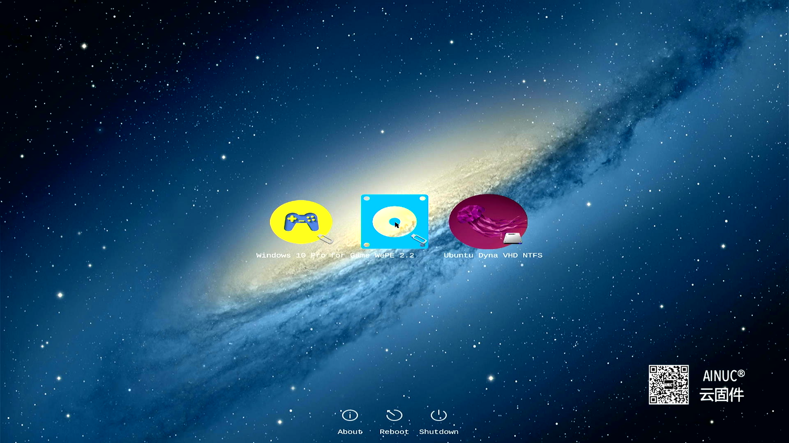
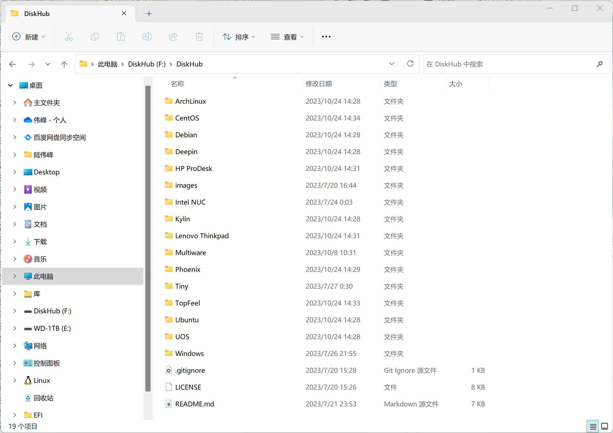
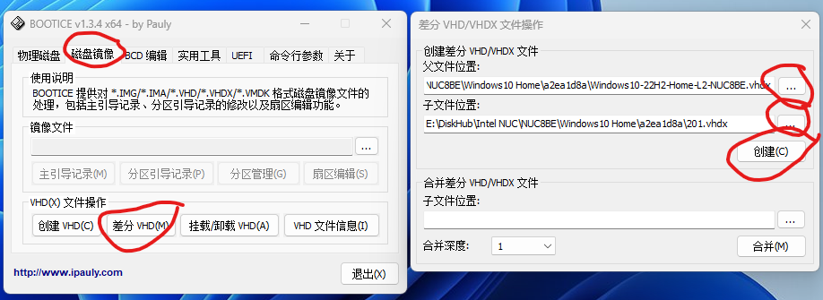

# 云固件快装U盘（快优）用户手册

欢迎大家使用云固件快装U盘！期待云固件给您带来一种耳目一新的感觉！

## 1.云固件介绍

AINUC®️云固件（Multiware）是基于UEFI标准的固件扩展应用程序，通过将包含虚拟磁盘的镜像文件模拟为标准磁盘，实现了镜像文件内操作系统启动、多镜像文件切换以及复杂应用系统（包含操作系统、驱动程序、应用软件、配置信息、用户数据）快速部署，亦可支持虚拟磁盘镜像文件部署在移动存储设备。

简单的来说，好比在一台主机上安装多块硬盘，每块硬盘都包含完整的系统，启动计算机的时候选择启动管理器切换硬盘来切换系统。但一台主机可以安装的硬盘数量有限，而且更多的硬盘代价也很高，云固件把这些物理硬盘虚拟成虚拟硬盘，再实现了针对虚拟硬盘的启动过程。同时，虚拟硬盘所对应的虚拟文件可以实现快速添加、复制、删除、差分、共享等等物理硬盘无法实现的高级功能，给用户带来了更大的便利性。

云固件可以独占主机存储，也可以和其他系统分享主机存储，使用起来非常简单和方便。

## 2.快装U盘介绍

快装U盘（快优）是了为了进一步降低用户使用云固件难度推出的产品。

快优本身包含一个可以直接启动的云固件，用户可以直接引导计算机。当用户配置好镜像文件存储分区和可启动的镜像后，主界面就会呈现出来选择菜单，用户选择对应菜单就可以完成镜像启动了。



快优是一个USB 3.0 Gen 2（USB 3.2）规格、128G容量的高速U盘，硬件本身是金士顿品牌产品。除去100M的ESP分区后，剩余空间全部为MW数据分区，分区格式为ExFat，支持Windows、Linux、MacOS的读写。

在MW分区内，保存有以下内容：

- Main 云固件主程序（仅作安装用途）
- DiskHub 云固件镜像资源库
- Videos 云固件介绍视频
- Manual.pdf 云固件快优使用手册
- vd.config 云固件镜像分区配置文件

## 3.快装U盘镜像资源介绍

云固件快优提供了常见操作系统镜像文件，这些镜像保存在DiskHub镜像仓库文件夹下。为节省空间，这些镜像文件都使用7-zip进行了压缩，实际使用时需要在复制后的目标文件夹下解压缩后方能使用。



快优随盘提供的镜像包括：

- Windows 10 22H2
  - ISO
  - Home L1
  - Professional L1
- Windows 11 22H2
  - ISO
  - Home L1
  - Professional L1
- Ubuntu Desktop 22.04 LTS
  - ISO
  - Desktop L1
  - Desktop L3
- Ubuntu Kylin
  - 23.04 L1
  - 23.04 L3
- Deepin Desktop
  - Community 20.9 L1
- Windows PE
  - WePE 2.2 ISO

由于镜像众多，为了区分及后续镜像商店使用，每个镜像都定义了一个UUID来区分，并使用UUID的前8个字符作为文件夹名称。

*由于主机BIOS的完善程度不同、操作系统的支持能力不同，Windows以外的系统有可能会出现黑屏或者启动错误，如出现问题请向云固件小助手汇报错误信息*

## 4.快装步骤

快优本身是一个普通U盘，不适合类似硬盘的大量读写操作，因此安装时需要把镜像文件夹复制到硬盘上使用。对于ISO这类只读镜像，可以直接在快优上使用。

安装时，首先选定一个磁盘分区作为镜像存储分区即VDs分区，分区建议格式为NTFS。

其次，将需要的云固件虚拟磁盘镜像文件夹复制到VDs分区根目录下，通常镜像文件夹为8个16进制字符，比如“a172d04c”。

如果镜像文件是压缩文件，那么请解压到当前文件夹下。

修改VDs分区根目录下的vd.config配置文件，将虚拟磁盘镜像加入引导配置菜单。如果没有vd.config文件，直接用记事本创建一个空白文件进行修改。如menu.config配置文件已经引入，可不修改。如没有，可手动添加如下：

``` shell
include \a172d04c\menu.config
```

其中“a172d04c”为本例文件夹名称，"menu.config"文件名也可根据具体实例调整。
修改完成后，存盘，退出编辑操作。

以上步骤即完成了镜像文件的安装。如需更多镜像，重复第二步骤即可，非常的简单。

如果是没有系统的新主机，云固件快优默认包含了微PE的PE盘，启动后即可进入PE环境，按照上述步骤完成硬盘分区和文件复制即可。

云固件快优提供的免费版云固件最多支持3个镜像启动菜单。如果出现不够用的时候，可以将暂时不需要使用的镜像引入include前添加“#”进行注释，该镜像就会不出现在启动主界面，从而腾出菜单空位。

## 5.更多使用方法

云固件的Windows镜像支持复制模式，也支持差分模式。

### 复制模式

镜像文件夹复制到VDs分区下，根据自己的需要改名为符合用途的“Code”、“Work”、“Office”、“Home”、“Game”名称，也可以自定义名称，比如Code.vhdx，不支持中文字符。

### 差分模式

使用差分时，Windows在父子镜像文件跨文件夹时存在问题，所以需要把父子镜像都放在相同文件夹下。Windows下可使用演练场内提供的Bootice来完成。



创建后的差分镜像文件名称也建议修改为符合用途的名称，如Code.vhdx等。

*注意：复制和差分操作后，都需要修改menu.config和vd.config完成设置，方能在云固件主界面看到镜像选择菜单。*

## 6.结语

云固件快装U盘免去了用户安装云固件主程序的过程，免去了下载镜像文件的耗时，更快的体验“拿来主义”的便利性。对于云固件，欢迎大家提出宝贵的意见和建议！

更多说明可参考知乎上“AINUC云固件”专栏文章和视频。  
云固件相关文章和视频可在搜索引擎上搜索“云固件”或者“AINUC云固件”。  
欲了解更多信息可微信搜索“AINUC99”添加云固件小助手咨询，也可以直接扫描主界面内二维码添加。

云固件及云固件镜像提及的品牌、商标均为各自的所有者所拥有。
