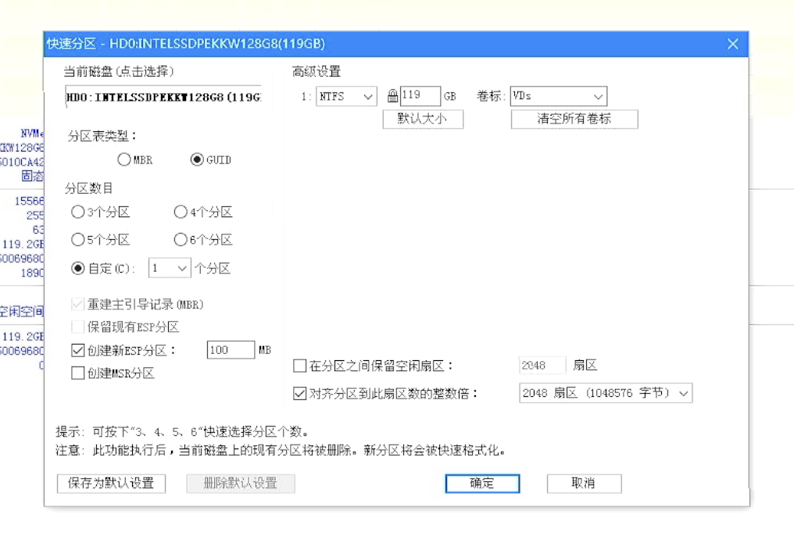
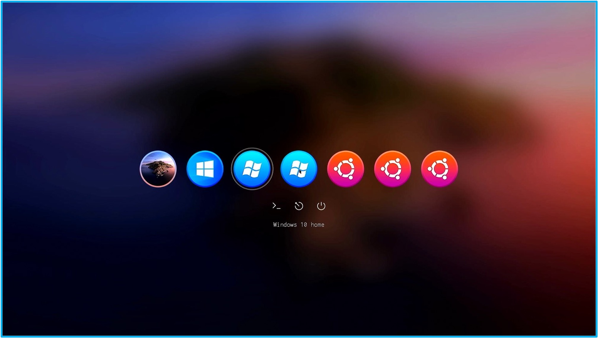
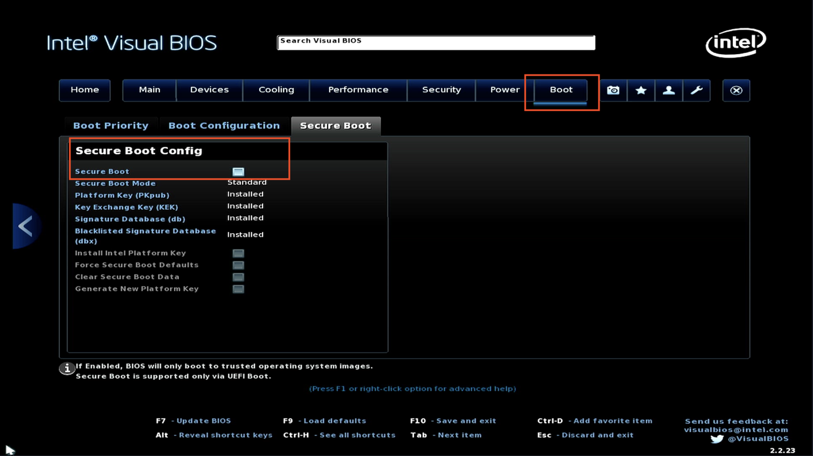

# 云固件移动模式的安装

本文档主要讲解云固件**移动模式**的安装过程与注意事项，面向L2级别用户。通过阅读本文档，L2及更高级别用户均可以完成云固件移动模式的独立安装。

文档涉及的品牌、商标等为各自所有者所拥有。本文档所描述“云固件”技术已经在中国国家知识产权局进行了专利注册。

## 0.引子

在之前的[标准安装文档](INSTALL.md)中，云固件是使用“安装模式”进行部署的，云固件主程序是安装到内置硬盘上的。当用户希望使用其他主机来进行后续工作时，需要把虚拟磁盘镜像文件拷贝到其他主机上才能继续进行，这样会比较不方便。云固件移动模式就是为了解决这种不便而诞生的。

## 1.前提与准备

- 2010年以后生产的个人计算机一台

建议选择2015年之后出厂的计算机，台式机或笔记本均可，Intel x86_64架构，Intel/AMD品牌CPU均可，支持UEFI固件；

- USB 3.0以上接口的外置移动硬盘一个

机械移动硬盘、固态移动硬盘或者固态U盘均可，推荐使用固态硬盘或者固态U盘。USB type-C接口的移动硬盘或者U盘需要测试，绝大多数机型均支持，但会有少数机型不支持作为启动盘。使用扩展坞的USB 3.0接口也会有兼容性问题，建议测试后使用。

USB 2.0接口的设备由于速度限制，不建议使用。部分计算机的USB接口不全是3.0接口，使用时务必选择USB 3.0及以上接口。

- 预装Windows PE的U盘一个

容量不限，支持通过USB启动到Windows PE系统，可选常见的大白菜、老毛桃、微PE等均可；

- 云固件安装包

云固件最新版本为v1.2.23418，可以通过以下链接下载：[云固件r23418下载](https://​pan.baidu.com/s/1P7_J_ie8caoLs6HFBXvQNw?pwd=l2gy)

下载后的安装包可以拷贝到PE盘或者其他移动硬盘；
最新安装包可添加文末的“AINUC”小助手微信来获取；

- 云固件虚拟磁盘镜像文件；

云固件虚拟磁盘和计算机硬件有一定关系，镜像级别低于L2为无差别镜像，可支持绝大多数常见计算机硬件。L2级别及以上级别对硬件有一定匹配要求，原则上不建议混装。比如Intel NUC 8BE（豆子峡谷）的镜像不建议安装到HP Desktop G600型号计算机上。

本例使用Intel NUC 8BE豆子峡谷为安装目标计算机，Windows 10 Pro镜像下载链接 [豆子峡谷Windows 10 Pro镜像下载](https://​pan.baidu.com/s/1GqBQH3Cn62f8fbb1YYRrnQ?pwd=cmdw)

为节省下载流量，磁盘镜像文件可能会使用压缩工具如“7-zip“进行压缩，使用前请解压缩到当前文件夹，也就是压缩文件所在文件夹。

## 2.启动计算机

连接计算机键盘、鼠标、显示器及电源，使用U盘启动计算机，进入Windows PE系统。

启动完成后，插上需要安装云固件的移动硬盘（U盘）。

## 3. 移动硬盘（U盘）分区及格式化

云固件使用最新的固件程序及虚拟磁盘技术，需要将移动硬盘重新分区和格式化。移动硬盘必须使用GPT磁盘格式，之前的MBR磁盘格式不受支持。

云固件的使用需要至少2个分区，分别为云固件程序所在的EFI系统分区（ESP）、虚拟磁盘存储分区（VDs）。用户也可根据多系统共享数据需要创建数据分区（DATA）。

**选择硬盘时务必小心，选择正确的移动硬盘，请勿选择内置硬盘！**

创建EFI系统分区，分区大小为100M，卷标为ESP，分区格式为FAT（FAT16）。ESP分区不建议超过100M，过大空间没有利用价值。

创建虚拟磁盘存储分区，分区大小为物理硬盘剩余空间，卷标为VDs，分区格式为NTFS（不支持压缩、不支持加密）。


使用DG快速分区

可选创建数据分区，分区大小由用户自定义，卷标为DATA，分区格式建议为exFAT，这样可方便Windows及Linux读写。

## 4. 复制云固件主程序

将下载的云固件程序解压缩，得到EFI文件夹，将此文件夹复制到ESP分区。
将vd.config文件复制到VDs分区根目录下。

## 5. 复制虚拟磁盘镜像

将下载的云固件虚拟磁盘镜像文件夹复制到VDs分区根目录下，通常镜像文件夹为8个16进制字符，比如“a172d04c”。

修改vd.config配置文件，将虚拟磁盘镜像加入引导配置菜单。如menu.config配置文件已经引入，可不修改。如没有，可手动添加如下：

``` shell
include \a172d04c\menu.config
```

其中“a172d04c”为本例文件夹名称，"menu.config"文件名也可根据具体实例调整。
修改完成后，存盘，退出编辑操作。

## 6. 重新启动

安全退出云固件及虚拟磁盘镜像存储的介质，如U盘或者移动硬盘，拔下存储介质，保留安装好云固件的移动硬盘。在Windows PE下选择重新启动。
系统进入重新启动后，拔下Windows PE启动U盘。
重新启动后，在BIOS界面选择启动设备，通常是F10/F12等功能键，进入选择菜单后，选择安装好云固件的移动硬盘。
个人计算机应该会自动进入云固件的启动界面，用户选择需要启动的虚拟磁盘图标即可启动对应的虚拟磁盘系统。


云固件主界面

## 7. 注意事项

云固件使用UEFI作为运行环境，但各个计算机及主板厂商的完善程度差异很大，导致出现的问题也千奇百怪。云固件尽可能按照UEFI 2.7的标准进行编码和测试，以满足常见计算机设备。

### 7.1 安全启动（secure boot）

云固件最新版本r23418还处在beta测试阶段，未使用secure boot要求的数字签名，测试时需要计算机在BIOS中间关闭secrue boot。未关闭secure boot时，计算机会弹出红色窗口提示错误。


Secure Boot

### 7.2 云固件启动界面图标变形

云固件使用图形界面启动系统，使用了BIOS中定义默认屏幕分辨率，由于外接的显示设备差异，默认得到的屏幕分辨率可能会出现不匹配的情况。比如默认分辨率比例为4:3，但实际显示器比例为16:9，此时屏幕上会出现主界面的圆形镜像菜单变形为椭圆形的情况。以上情况属于显示不正常，但功能使用均正常，不影响实际操作。部分显示器或者显卡在第二次重新启动会调整默认分辨率，之后显示就会恢复正常显示比例。

### 7.3 镜像启动失败

云固件使用本机物理硬件性能，由于操作系统、驱动程序、配置信息等原因，以及使用了不匹配的虚拟磁盘镜像，都可能出现启动失败现象。启动失败现象包括选择启动镜像后屏幕闪烁一下重新回到选择菜单、黑屏、键盘鼠标无响应等。出现以上情况，建议更换镜像，或者使用镜像级别低于L2级别的镜像。

### 7.4 多个VDs分区

云固件r23418版本仅支持一个VDs分区，当出现内置硬盘和外置硬盘存在一个以上VDs分区时，系统会选择第一个VDs分区作为镜像分区。由于顺序的不确定性，所以有可能出现菜单为内置硬盘的情况。

云固件判断镜像分区时的依据是镜像分区根目录下的vd.config文件，出现错误时，可以将内置硬盘镜像分区内的vd.config更名，如vd.config.bak。云固件就会忽略该镜像分区。

## 8. 修改记录

v1.0 2023/5/22 陆伟峰 云固件移动模式安装初始版本

## 9. 联系方式

云固件小助手微信：“AINUC99”
