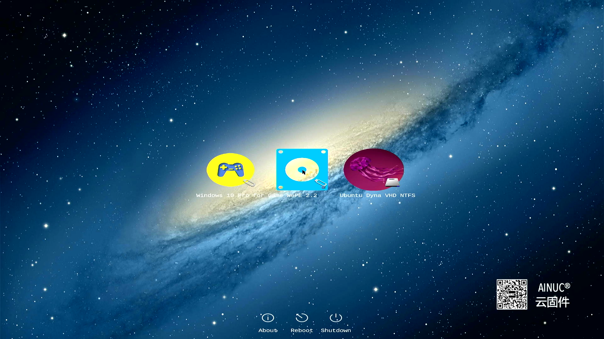

# 云固件版本r1.6.23942更新记录

自上个版本r23715之后，云固件经过了3个月的开发及测试周期，实现了较大的功能提升，本次发行版本为r23942。
版本号最终确定为v1.6.23942，发行日期为2023/10/22。

下载链接：
[百度网盘](https://pan.baidu.com/s/1E3LKPlyAZCUX8PhIkIu98Q?pwd=7217)

本次版本的改动较多也较大，引入了内置启动助手文件并大范围调整了目录结构，安装时需要把之前的版本全部删除后再重新复制过去，避免覆盖式安装造成文件重复或者文件遗留造成的未知错误。

## 1.支持Secure Boot（安全启动）

r23942引入了第三方提供的基于红帽Fedora的SecureBoot方案，目前作为安全启动的临时方案，提升用户体验，后续代码稳定后会申请微软的签名服务，可以无缝替换。
打开安全启动后，第一次启动会提示未签名，选择Enroll Key即可，后续就不会再弹出这个界面了。


## 2.启动加载器和UI界面分离

原先统一的MW.efi程序拆分为启动加载器（MW.efi）和UI界面（BootUI.efi）两个部分。MW.efi后续会申请微软签名服务，作为云固件的启动加载器。
BootUI也剥离之前的GPL代码。
程序文件保存目录结构也进行了调整：

- Boot目录下只保留第三方的启动代码和MW.efi启动加载器；
- Drivers目录下保存GPL版权的DXE驱动程序；
- MW目录下为云固件的程序及文件，包括启动加载器和界面、vdboot.efi工具以及辅助的图片文件；

## 3.支持多个VDs（镜像文件存储分区）

在之前发行的版本中，云固件只支持搜索到的第一个VDs分区，其他分区是不支持，本次发行可以支持任意多个VDs分区。VDs分区可以是内置硬盘，也可以是外置硬盘。
实际使用时，建议普通U盘存储ISO这样的只读镜像，VHD及VHDx磁盘镜像保存在内置硬盘或者固态U盘上。
注：在文件系统根目录下有vd.config这个文件，云固件就会认为这个分区是存储磁盘镜像的VDs分区，该分区可以和其他文件包括其他操作系统文件共享。

## 4.支持向操作系统或者启动管理器透传镜像启动信息

用户选中启动镜像并启动后，云固件会把镜像信息写入NVRAM，镜像内的启动管理器比如grub或者Linux内核可以读取这个信息，并利用这个信息判断是云固件模式启动进而配置根文件系统。
镜像启动信息包括镜像所在分区的Part Guid、分区文件系统格式、镜像文件名称（含绝对路径）以及镜像文件格式。
镜像信息键值为“MwVDInfo”，GUID为“d5b8d8f4-3ff0-4b43-81d5-4af802412a84”。

## 5.支持定义镜像内操作系统类型

镜像配置文件，默认为menu.config，支持menuentry内定义镜像内操作系统类型名称，如“Win”、“W”、“windows”均可代表微软视窗系统。其他操作系统如L代表Linux，B代表BSD家族系统。系统只读取第一个字符进行操作系统判断，不区分大小写。

目前实际使用上仅仅针对Windows系统有效，其他系统未使用。

## 6.支持内置启动助手启动Windows类型镜像

r23942之前发布的版本中，Windows镜像都需要配置一个专用Helper来辅助启动，为此专门提供了一个“演练场”镜像。本次发行版本内置了针对Windows系统的Helper，并自动识别Windows镜像文件名称和路径，自动配置Windows BCD文件，实现了Windows镜像的智能启动。

Windows类型镜像启动配置文件示例：

``` shell
menuentry "Windows 10 Pro" {
  icon "\99887766\win11.png"
  vdisk "\99887766\Work.vhdx"
  vdtype vhdx
  ostype windows
}
```

## 7.支持基于initramfs类型的Linux免启动助手

通过使用MwVDInfo，Linux启动脚本可以读取到镜像文件信息，利用这个信息，初始化内存盘的脚本可以判断出来是否在云固件启动模式还是在虚拟机启动模式，当使用云固件启动模式时，启动脚本可以配置镜像文件作为根系统；其他情况则忽略这些脚本操作。

Linux的启动脚本通常为initramfs、initcpio、dracut这三种方式。

截止到目前完成了initramfs的脚本编写，使用initramfs方式的Linux发行版包括Debian、Ubuntu，以及国产操作系统Deepin、UOS、Ubuntu Kylin。initcpio和dracut后续会随对应的Linux发行版镜像提供出来，和云固件主程序的版本无关。

Linux类型镜像启动配置文件示例：

``` shell
menuentry "Ubuntu 22.04 LTS" {
  icon "\22042003\ubuntu.png"
  vdisk "\22042003\Ubuntu-Desktop-22.04.2-L3.vhdx"
  vdtype vhdx
}
```

## 8.支持VHD动态模式镜像格式

新增加VHD动态模式镜像格式的支持。VHD动态模式及未完善的差分模式主要用于Windows 7系统，由于windows系统内置VHD格式的支持，所以此镜像格式实际使用上并不常用。


## 9.支持VHDx固定及动态模式镜像格式

新增加VHDx格式支持，支持三种模式中的固定及动态两种，差分模式的支持会在后续提供。VHDx模式是云固件镜像的主要发行模式，前期由于Windows系统和Linux系统都提供内置支持或者辅助启动支持，所以云固件并未支持。当前版本支持后，后续Linux系统就可以不用使用单独的Helper启动辅助镜像了。

如上图，镜像文件夹内变得非常简单。

## 10.支持ISO格式光盘镜像启动

新增加光盘镜像ISO格式的支持，云固件可以直接启动ISO镜像。通常这些ISO是操作系统安装盘，或者Windows PE这样的工具盘。

云固件针对镜像文件的复制、差分等等操作可以通过PE工具盘内的工具来实现，无须使用EFI SHELL命令行，简化了操作难度。

## 11.支持在镜像选择菜单上显示来源的徽章

当前版本支持多个VDs分区，当出现重名的启动镜像时很难通过icon和title来区别，因此云固件提供了镜像来源的徽章来帮助用户区别。徽章会根据存储设备的不同显示内置硬盘和外置USB硬盘（含U盘）的不同徽标。



## 总结

r1.6.23942版本新增功能较多，基本上实现了我对2.0版本之前的需求定义，简单的说实现了“云固件”名称中的“固件”功能，后续会完善“固件”相关的次要功能。云固件大版本2.0会增加“云”相关需求，欢迎大家关注我、支持我。

更多说明可参考知乎上“AINUC云固件”专栏文章和视频。  
云固件相关文章和视频可在搜索引擎上搜索“云固件”或者“AINUC云固件”。  
欲了解更多信息可微信搜索“AINUC99”添加云固件小助手咨询。

云固件及云固件镜像提及的品牌、商标均为各自的所有者所拥有。
