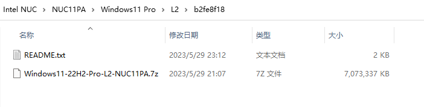

# 云固件的使用

云固件将虚拟磁盘镜像模拟为物理磁盘，启动虚拟磁盘中的操作系统，实现了将操作系统、驱动程序、应用软件、配置和数据部署在镜像文件中，极大的简化了后续维护、备份和恢复的工作任务。同时，基于镜像文件的差分能力使得复杂工作能够被分阶段处理，带来了传统分区部署上无法实现的便捷性。

## 启动形态

云固件支持多种方式的部署，核心差别就是云固件主程序和虚拟磁盘镜像文件存储带来的差别。如下表所示：

|顺序|模式|云固件主程序|镜像文件|备注|
|:-:|:---:|:--------:|:-----:|:---|
|1|安装模式（独占）|内置硬盘ESP分区|内置硬盘VDs分区|独占主机的安装模式|
|2|移动模式|固态U盘或移动硬盘ESP分区|固态U盘或移动硬盘VDs分区|独占固态U盘或移动硬盘|
|3|外置模式|U盘ESP分区或启动分区|内置硬盘分区，可共享|与其他操作系统共享数据存储分区|
|4|混合模式|共享内置硬盘ESP分区|共享内置硬盘分区|与其他操作系统共享ESP分区及数据存储分区|

除了第一种“安装模式”外，第二、三种模式一般都需要在主机启动时选择U盘或者移动硬盘上的云固件，最后一种模式需要在主机启动后选择多重启动中的云固件启动项。  
后三种模式，用户也可以在计算机主机的BIOS中调整启动顺序，将云固件设置为第一启动项，后续再启动时就不需要做选择了，计算机会优先启动云固件。

## 云固件主界面


云固件的主界面是非常简洁的，整个屏幕共分成三行，第一行为镜像选择菜单，第二行为功能菜单，当鼠标移动到第一、二行菜单的图标上时，会出现第三行文字描述用来说明选择菜单项的标题，通常是操作系统名称或者镜像用途等等。

镜像选择菜单的图标和文字标题，是在镜像文件所在文件夹的menu.config中的menuentry中定义，图标和文字都可以更改，这两个项目都是为了方便用户选择，所以合适的图标、合适的标题需要符合使用者的习惯。

当选择菜单比较多时，左右两侧会出现向左或者向右的箭头，提示用户左侧或者右侧还有选择菜单

选择菜单下方的三个功能菜单，分别是“关于”、“重启”和“关机”。“关于”提供了UEFI环境和云固件的信息，重启和关机就是重启计算机和关闭计算机的操作功能。

主界面上可以通过鼠标的移动进行菜单选择，通过鼠标左键点击来完成确认，也可以通过键盘上的上下左右四个方向来移动选择，按下回车键来确认选择。

## 云固件镜像的主入口配置文件

云固件主程序安装在ESP分区内，通常是不可见的，使用者通常也不需要了解它的存在。使用过程最重要的配置文件就是云固件镜像的主入口配置：vd.config。该文件保存在VDs分区，也可能和其他系统的文件混合在一次。但vd.config必须位于某个分区的根目录。

vd.config通常作为主入口配置文件，因此，它一般只使用include参数来配置，核心作用是把分散到各个镜像文件夹下的menu.config合并为一个总入口文件供云固件使用。如下例：

``` shell
include \a172d04c\menu.config
```

云固件截至到2023/07/15日，还不支持多个vd.config文件，当出现多个不同分区存在vd.config文件时，云固件会把识别分区时第一个遇到的vd.config提供给云固件作为入口配置文件，后续的文件都会被忽略。用户需要注意这种情况。

## 云固件镜像

云固件为常见系统和常见计算机类型提供了制作完备的各个分层镜像。这些镜像通常使用UUID来进行区分，UUID的前8位通常会被用来命名来文件夹，镜像文件使用7-zip压缩后存储在该文件夹下。

通常情况下，该文件夹下还会包含README.txt进行说明，该文件通常还包含镜像文件压缩前和压缩后的校验码。

发行的磁盘镜像分成两种类型：需配置后使用及直接使用。

### 配置后使用的镜像

配置后使用的镜像，通常为分层规范中的中间格式，提供该镜像的目的是给使用者在此基础上进一步部署后使用。



配合[云固件演练场](https://pan.baidu.com/s/1NxE7xWEQ1zyGDaCV4T56NQ)镜像，使用者可以通过复制或者差分该基础镜像进行后续加工处理，具体操作可参考演练场README.txt。

### 直接使用的镜像

直接使用的镜像，通常为制作完毕的镜像，制作者提供了差分好的子镜像和helper辅助引导（后续可取消），并添加了menu.config中的引导参数。使用者只需引入全局vd.config即可在启动界面上看到对应的选择菜单。当然，使用者还可以继续创建差分或者进一步加工到自己需要的更高层级使用环境。


## 总结

云固件分成主程序、主入口配置文件和镜像文件夹三个层级，每个层级的功能都是非常明确的，使用者仅需要简单配置即可实现多个镜像部署、差分等非常复杂的功能，极大方便和简化了计算机部署与维护。

更多云固件启动参数配置说明可参考演练场menu.config内注释以及知乎上“AINUC云固件”专栏文章和视频。

云固件相关文章和视频可在搜索引擎上搜索“云固件”或者“AINUC云固件”。

欲了解更多信息可微信搜索“AINUC99”添加云固件小助手咨询。