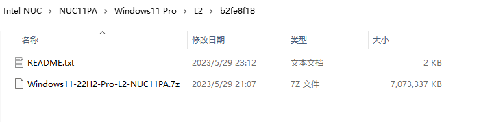
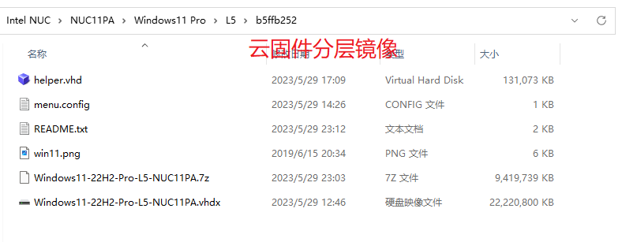

# 云固件虚拟磁盘

AINUC®️云固件（Multiware）是基于UEFI标准的固件扩展应用程序，通过将包含虚拟磁盘的镜像文件模拟为标准磁盘，实现了镜像文件内操作系统启动、多镜像文件切换以及复杂应用系统（包含操作系统、驱动程序、应用软件、配置信息、用户数据）快速部署，亦可支持虚拟磁盘镜像文件部署在移动存储设备。

镜像文件就相当于物理硬盘。镜像文件有很多种格式，比如最常见的raw格式，也就是把硬盘上的数据1：1的复制到文件中。Windows系统通常使用VHD/VHDx作为基本镜像格式，Linux平台通常使用HDD/RAW格式，其他虚拟化平台还使用VMDK、VDI、QCOW/QCOW2等多种格式。

## 默认格式

云固件通常使用VHD(x)作为标准的镜像格式，但制作的方法和微软提供的VHD(x)镜像格式制作过程有很大的不同。

## 格式差异

具体差异主要表现在微软要求的本地启动VHD镜像使用位于VHD(x)文件之外的引导管理器（Boot Loader），而云固件使用VHD(x)镜像文件内ESP分区内的引导管理器。因此，云固件使用的VHD(x)镜像文件是可以作为虚拟机的磁盘启动的，但微软要求的本地启动VHD(x)镜像是无法启动，原因是缺少ESP分区。

VHD(x)镜像格式支持Fixed、Dynamic、Difference三种模式，其中Difference模式（差分模式）可以生成父子镜像，提供了快照、回滚等多种高级功能，云固件充分利用了这些能力来方便用户。

## 标准镜像文件

云固件提供了标准镜像文件，使用VHDx动态格式，容量为256G，区块大小为默认值；分区使用GPT格式。

## 分层规范

云固件支持差分格式的磁盘镜像格式，为了让制作的镜像文件能够得到最大化的利用，云固件提出了如下分层规范：

1. 分层按照L0-L9来定义；
1. 高层级镜像原则上要求包含低层级全部镜像内容；
1. 除L0级别外，每个层级均可以生成差分级别；
1. 同层级的差分镜像使用层级加两位数的顺序号来区分，如301，305，501，511等；

## 发行方式

云固件为常见系统和常见计算机类型提供了制作完备的各个分层镜像。这些镜像通常使用UUID来进行区分，UUID的前8位通常会被用来命名来文件夹，镜像文件使用7-zip压缩后存储在该文件夹下。

通常情况下，该文件夹下还会包含README.txt进行说明，该文件通常还包含镜像文件压缩前和压缩后的校验码。

发行的磁盘镜像分成两种类型：需配置后使用及直接使用。

### 配置后使用的镜像

配置后使用的镜像，通常为分层规范中的中间格式，提供该镜像的目的是给使用者在此基础上进一步部署后使用。

配合[云固件演练场](https://pan.baidu.com/s/1NxE7xWEQ1zyGDaCV4T56NQ)镜像，使用者可以通过复制或者差分该基础镜像进行后续加工处理，具体操作可参考演练场README.txt。

### 直接使用的镜像

直接使用的镜像，通常为制作完毕的镜像，制作者提供了差分好的子镜像和helper辅助引导（后续可取消），并添加了menu.config中的引导参数。使用者只需引入全局vd.config即可在启动界面上看到对应的选择菜单。当然，使用者还可以继续创建差分或者进一步加工到自己需要的更高层级使用环境。

更多启动参数配置说明可参考演练场menu.config内注释以及知乎上“AINUC云固件”专栏文章和视频。

云固件相关文章和视频可在搜索引擎上搜索“云固件”或者“AINUC云固件”。
欲了解更多信息可微信搜索“AINUC99”添加云固件小助手咨询。
