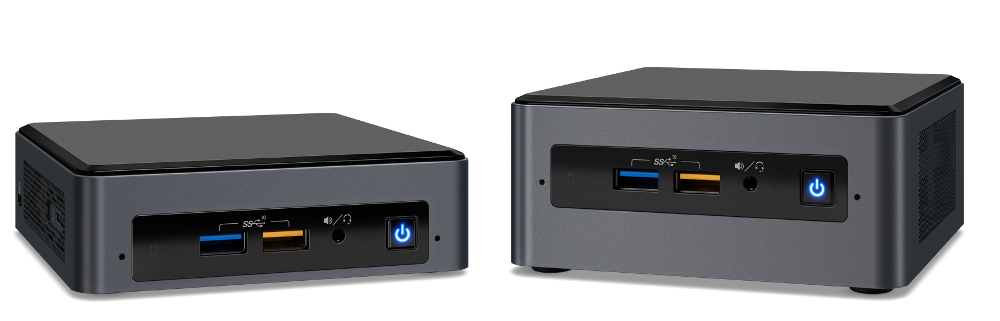

# Intel NUC NUC8BE 豆子峡谷

Next Unit of Computing (NUC) 是一种小型设备或计算元件，可提供全面的台式机体验、游戏体验或边缘设备体验。NUC迷你电脑包含标准电脑的所有组件：处理器、内存、固态硬盘、LAN或Wi-Fi，并支持集成和独立显卡选项。最初采用迷你电脑形式的设备现在已经发展成用户期盼已久的新一代解决方案，因此得名NUC。["描述来源"](https://www.intel.cn/content/www/cn/zh/products/docs/boards-kits/nuc/what-is-nuc-article.html)

该系列搭载了英特尔28W 低压处理器，包括i3-8109U/i5-8259U/ i7-8559U，售价2499元到4099元不等。

英特尔NUC迷你电脑主机“豆子峡谷”外形只有0.7L，支持M.2固态硬盘。配置方面，i3-8109U双核四线程，主频3.0GHz，睿频3.6GHz；i5-8259U为四核八线程，主频2.3GHz，睿频3.8GHz；i7-8559U为四核八线程，主频2.7GHz，睿频4.5GHz。三款CPU核显都为 Iris Plus 655，300MHz-1.05GHz。

## 主要型号

- NUC8i3BEH：i3-8109U
- NUC8i5BEH：i5-8259U
- [NUC8i7BEH](https://www.intel.cn/content/www/cn/zh/products/sku/126140/intel-nuc-kit-nuc8i7beh/specifications.html)：i7-8559U
- NUC8i3BEK：i3-8109U
- NUC8i5BEK：i5-8259U
- [NUC8i7BEK](https://www.intel.cn/content/www/cn/zh/products/sku/192580/intel-nuc-kit-nuc8i7bek/specifications.html)：i7-8559U

## AINUC®️云固件

云固件（Multiware）是基于UEFI标准的固件扩展应用程序，通过将包含磁盘镜像的镜像文件模拟为标准磁盘，实现了镜像内操作系统启动、多镜像操作系统切换以及复杂应用系统（包含操作系统、驱动程序、应用软件、配置信息、用户数据）快速部署，亦可支持磁盘镜像文件部署在移动设备。

## Windows 10 系列镜像

豆子峡谷常见的Windows部署为Windows 10 Home和Windows 10 Professional版本。Windows系列镜像支持分层部署。[什么是云固件分层镜像]

### Windows 10 Home

Windows 10 Home 2022H2 x64 中文版本

- L0
- L1
- L2
- L3
- L4
- L5

### Windows 10 Professional

Windows 10 Professional 2022H2 x64 中文版本

- L0
- L1
- L2
- L3
- L4
- L5

## Ubuntu 系列镜像

豆子峡谷支持Ubuntu长期支持版本LTS包括Ubuntu 16.04、18.04、20.04等等。Ubuntu系列镜像不支持分层镜像及动态磁盘模式。[什么是云固件分层镜像] [什么是云固件动态磁盘]

### Ubuntu Desktop 18.04 LTS

- 36G容量标准部署

### Ubuntu Desktop 20.04 LTS

- 36G容量标准部署

### Ubuntu Desktop 22.04 LTS

- 36G容量标准部署
